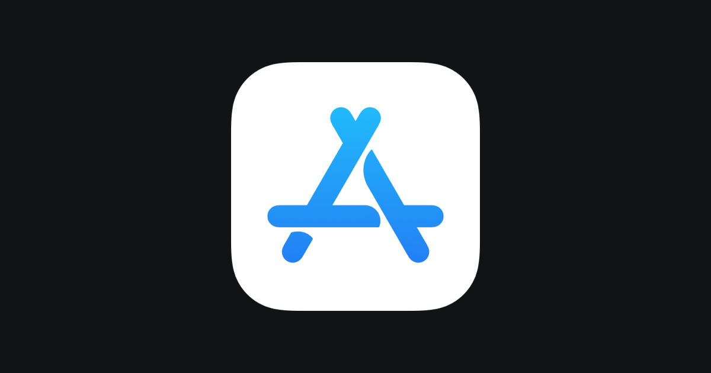

# get_app



## Overview

**get_app** is a command line application for get app from App Store Connect using api.

## Feature
- Download newest .ipa or .app from app store connect with specific workflow name and artifact name
- Get app .ipa or .app version and save to version.txt file

## Community

--

## Sponsor

Help keep this project alive. By sponsoring the [get_app tier](https://github.com/sponsors/dikako)
you will help support:

- Keeping up with api changes
- Development of new features
- Fixing and answering of issues
- Writing of guides and docs

## Getting started

### Requirements

- [Creating API Keys for App Store Connect API](https://developer.apple.com/documentation/appstoreconnectapi/creating_api_keys_for_app_store_connect_api)
- [Generating Tokens for API Requests](https://developer.apple.com/documentation/appstoreconnectapi/generating_tokens_for_api_requests)


### Install binary

- ``brew install ruby@3``
- ``gem install jwt``
- ``gem install httparty``
- ``gem install json``
- ``gem install jsonpath``
- ``gem install rubyzip``
- ``brew tap dikako/app-store-connect``
- ``brew install get_app``

## Usage
```
get_app --file-p8=$AUTH_KEY --issuer-id=$ISSUER_ID --key-id=$KEY_ID --product=$PRODUCT_NAME --workflow="$WORKFLOW_NAME" --art="$ART"

--file-p8                           File AUTH_KEY generated from app store connect (Required) ex: XXXXXXX_XXXXXXXXXX.p8              
--issuer-id                         ISSUER_ID generated from app store connect (Required) ex: 00x0dx0x-x0x0-00x00-x000-0x0x0x00x0x0               
--key-id                            KEY_ID generated from app store connect (Required) ex: 0XX000XXX       
--product                           PRODUCT_NAME Product name (Required) ex: Myapp      
--workflow                          WORKFLOW_NAME generated from app store connect (Required) ex: Production Build           
--dir                               DIR generated from app store connect (Optional) ex: app
--art                               ART artifact name ex: Development           
```

## Author
- [Fransiskus Andika Setiawan](https://www.linkedin.com/in/fransiskus-andika-setiawan/)

## Contributing

- 
